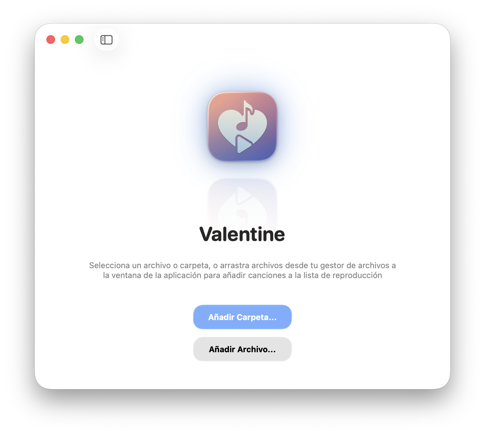
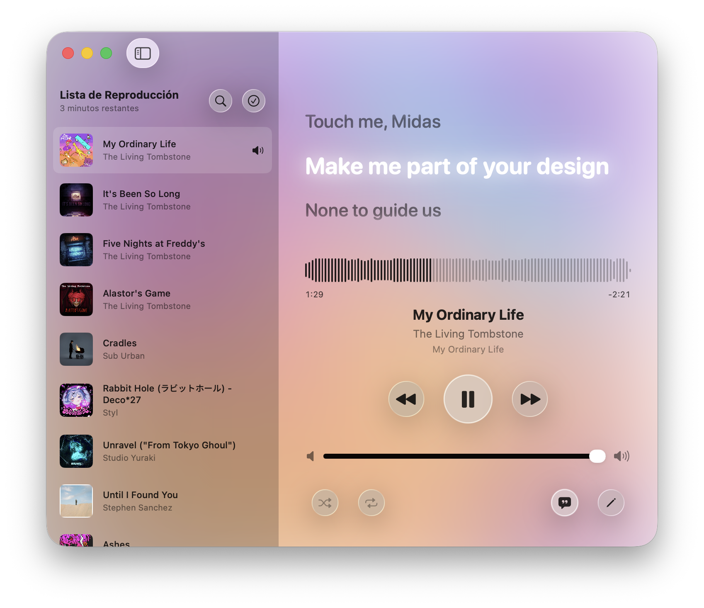
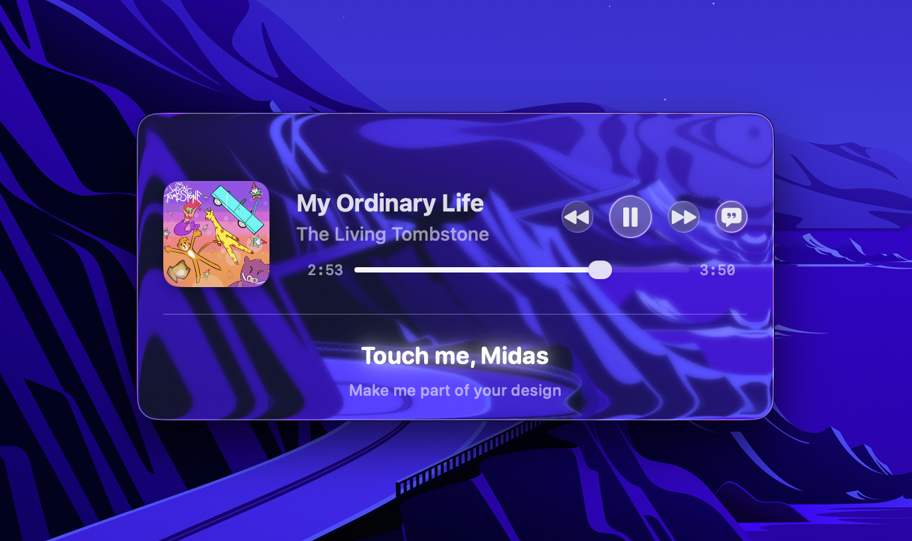

<div align="center">
  
  
  <h1>♥️ Valentine</h1>
  <p><strong>The best local music player for MacOS</strong></p>
  <p>The most elegant way to listen to your music files on your Mac, with a native and intuitive interface</p>

  <p>
    [](https://apple.com)
    [](https://swift.org)
    [](#)
    [](#)
  </p>
  <p>
    [](https://github.com/jesuschapman/valentine/stargazers)
    [](https://github.com/jesuschapman/valentine/issues)
    [](https://github.com/jesuschapman/valentine/releases/latest)
    [](https://liberapay.com/jesuschapman)
  </p>
</div>

<br/>

## 🌟 Overview
**Valentine** is a premium, beautifully crafted macOS application designed to parse, display, and directly edit ID3 tags for synchronized lyrics (LRC) inside your audio files. Built entirely natively with SwiftUI, it perfectly embraces Apple's design language featuring smooth "Liquid Glass" interfaces, dynamic glowing themes, and robust multimedia controls.

<div align="center">

## Synchronized lyrics  

  


## Mini-Player

  
</div>

---

## ✨ Key Features
- **Mutagen Powered ID3 Editing:** Valentine uses Python's `mutagen` under the hood to ensure robust, standard-compliant writing of metadata and lyrics directly into audio files (`.mp3`, `.flac`, `.m4a`, etc.).
- **Synchronized Lyrics Player:** Watch your lyrics highlight in real time, natively parsing LRC timestamps.
- **Dynamic Themes:** Adapts instantly to macOS Light and Dark mode. Features vivid neon glows, customizable typefaces, and a heavy use of Glassmorphism (blur backgrounds).
- **Native Media Controls:** Fully integrates with macOS media keys. Control your music right from your keyboard, Touch Bar, or your AirPods.
- **Drag & Drop:** Seamlessly drag your audio files and folders from Finder directly into the application window to populate your playlist.

---

## 🛠️ Built With (APIs & Libraries)
Valentine is made possible by these incredible open-source projects:

- **[LRCLib](https://lrclib.net/)**: The open-source lyrics API used to seamlessly search and fetch precise, time-synchronized `.lrc` lyrics.
- **[Mutagen](https://mutagen.readthedocs.io/)**: A highly robust Python multimedia tagging library used by our `MutagenInstallerService` to inject the lyrics securely into the ID3 metadata.
- **[AVFoundation](https://developer.apple.com/av-foundation/)**: Apple's native framework driving the `AudioEngine`, providing flawless audio playback and waveform data.

---

## 🚀 How to Compile

To build Valentine from source, you need a Mac running **macOS Tahoe 26** or newer, and Xcode installed.

1. **Clone the repository:**
   ```bash
   git clone https://github.com/jesuschapman/valentine.git
   cd valentine
   ```
2. **Open the Xcode Project:**
   ```bash
   open Valentine.xcodeproj
   ```
3. **Configure the Project:**
   - Go to the project settings and ensure you have selected your Apple Developer ID team.
   - Valentine uses Xcode 16's Synchronized Folders, so everything is ready to go out of the box.
4. **Build & Run:**
   - Select your Mac as the destination.
   - Press `Cmd + R` to compile and launch. 
   *(Note: The app will prompt you to install Mutagen via its UI dynamically if Python 3 is present on your system).*

---

## 💖 Sponsor this project
If you enjoy using Valentine or simply want to support its continued development, please consider buying me a coffee. Your support means the world and helps keep this app maintained and free!

<a href="https://liberapay.com/jesuschapman">
  
</a>

---

## 📄 License
This project is licensed under the GNU General Public License. See the [LICENSE](LICENSE) file for more details.
